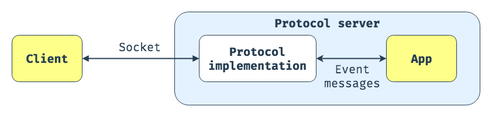

`ASGI` (англ. `Asynchronous Server Gateway Interface`) — клиент-серверный протокол взаимодействия 
веб-сервера и приложения, дальнейшее развитие технологии `WSGI`. По сравнению с `WSGI` предоставляет 
стандарт как для асинхронных, так и для синхронных приложений, с реализацией обратной совместимости 
`WSGI` и несколькими серверами и платформами приложений.

`ASGI` состоит из двух различных компонентов:

1. сервера протокола (`protocol server`) — слушает сокеты и преобразует их в соединения и сообщения 
о событиях внутри каждого соединения.
2. приложения (`application`), которое живет внутри сервера протокола, его экземпляр создается один 
раз для каждого соединения и обрабатывает сообщения о событиях по мере их возникновения.



Таким образом, согласно спецификации, то, что действительно указывает `ASGI` — это формат сообщения и то, 
как эти сообщения должны передаваться между приложением и сервером протокола, который его запускает.

ASGI опирается на простую модель: когда клиент подключается к серверу, создается экземпляр приложения. 
Затем входящие данные передаются в приложение и отправляются обратно все данные, которые оно возвращает.

Передача данных в приложение здесь в действительности означает вызов приложения, как если бы оно было 
функцией, т.е. чем-то, что принимает некоторые входные данные и возвращает выходные.

Все, что представляет собой `ASGI`-приложение — это callable (вызываемый объект). Параметры этого 
вызываемого объекта, опять же, определяются спецификацией `ASGI`:

```python
async def app(scope, receive, send):
    ...
```

Сигнатура этой функции — как раз то, что означает "I" в "ASGI": интерфейс, который должно реализовать 
приложение, чтобы сервер смог его вызвать. Параметры функции:

- `scope` — это словарь, содержащий информацию о входящем запросе. Его содержимое отличается для HTTP 
и WebSocket соединений.
- `receive` — асинхронная функция для получения сообщений о событиях ASGI.
- `send` — асинхронная функция для отправки сообщений о событиях ASGI.

Эти параметры позволяют получать (`receive()`) и передавать (`send()`) данные по каналу связи, который 
поддерживает сервер протокола, а также понимать, в каком контексте (или `scope`) этот канал был создан.
