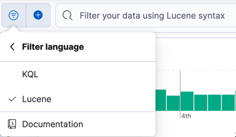

# Формирование запросов в ELK

Kibana предоставляет 3 способа отфильтровать данные:

1. `Kibana Query Language` (`KQL`)
2. синтаксис запросов `Lucene` и
3. `Elasticsearch Query Language` (`ES|QL`), который на момент написания этого текста находился 
на стадии технического ревью и не был рекомендован к использованию в продакшене.

### KQL

`KQL` - это простой текстовый язык запросов для фильтрации данных.

`KQL` **только фильтрует данные и не играет никакой роли в агрегировании, преобразовании или 
сортировке данных**. `KQL` не следует путать с языком запросов `Lucene`, который имеет другой 
набор функций. `KQL` используется для фильтрации документов, в которых значение для поля существует, 
соответствует заданному значению или находится в пределах заданного диапазона.

**Отфильтровать документы, в которых существует поле http.request.method**:

```shell
http.request.method: *
```

**Отфильтровать документы, которые соответствуют значению**:

```shell
http.request.method: GET
```

Название поля необязательно. Если не указать название поля, то поиск будет происходить по всем
полям. 

```shell
Hello
```

В случае если поисковый запрос сложный, например, содержит два и более слова, то запрос вида:

```shell
http.request.body.content: null pointer
```

то есть `null pointer` не обрамлен кавычками, то в выборку будут попадать документы, содержащие
хотя бы одно слово. 

Если же необходимо найти документ, в которых ищется фраза целиком, то необходимы кавычки:

```shell
http.request.body.content: "null pointer"
```

**Отфильтровать диапазон**

```shell
http.response.bytes > 10000 and http.response.bytes <= 20000
```

Можно также использовать синтаксис диапазона для строковых значений, IP-адресов и временных меток. 
Например, для поиска документов более ранней, чем двухнедельной давности, используйте следующий синтаксис:

```shell
@timestamp < now-2w
```

**Фильтрация с использованием wildcard-синтаксиса**

Если нужно отфильтровать коды, которые начинаются с `4`:

```shell
http.response.status_code: 4*
```

**Отрицание**

Чтобы отфильтровать документы, в которых `http.request.method` НЕ `GET`:

```shell
NOT http.request.method: GET
```

**Комбинирование запросов**

Комбинирование возможно при помощи ключевых слов `and`/`or`

```shell
http.request.method: GET OR http.response.status_code: 400
```

KQL применяется по умолчанию. Однако, если возможностей KQL не хватает, то можно переключиться
на язык запросов Lucene.

## Синтаксис запросов Lucene

Основная причина использования синтаксиса запросов `Lucene` в `Kibana` заключается в расширенных 
функциях `Lucene`, таких как регулярные выражения или нечеткое сопоставление терминов. Однако 
синтаксис `Lucene` не позволяет выполнять поиск по вложенным объектам или полям сценариев.

Чтобы переключиться на синтаксис Lucene, необходимо переключить `Language`:



**Отфильтровать по диапазону**:

```shell
response:[400 TO 599]
```

Прим. Между `:` и `[` не должно быть пробела.

**Отфильтровать отрицанием**:

```shell
NOT log.offset: 1
```

**Отфильтровать по произвольному выражению**:

```shell
мой запрос
```

Как в случае с `KQL` необходимо принять решения касательно использования кавычек.

**Отфильтровать по значению поля**:

```shell
color:orange
```

**Отфильтровать документы, в которых есть поле `destination`**:

```shell
_exists_:destination
```

Отфильтровать по регулярному выражению:

```shell
mail:/mailbox\.org$/
```

**Отфильтровать нечетким поиском**:

```shell
user:maria~
```

Кратко side-by-side [сравнение KQL и синтаксиса запросов Lucene](https://www.timroes.de/kibana-search-cheatsheet).

