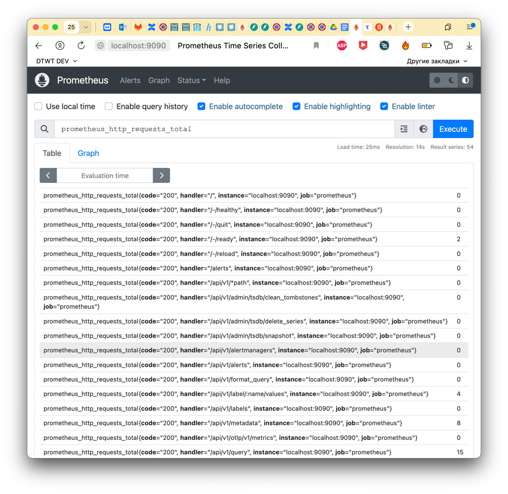
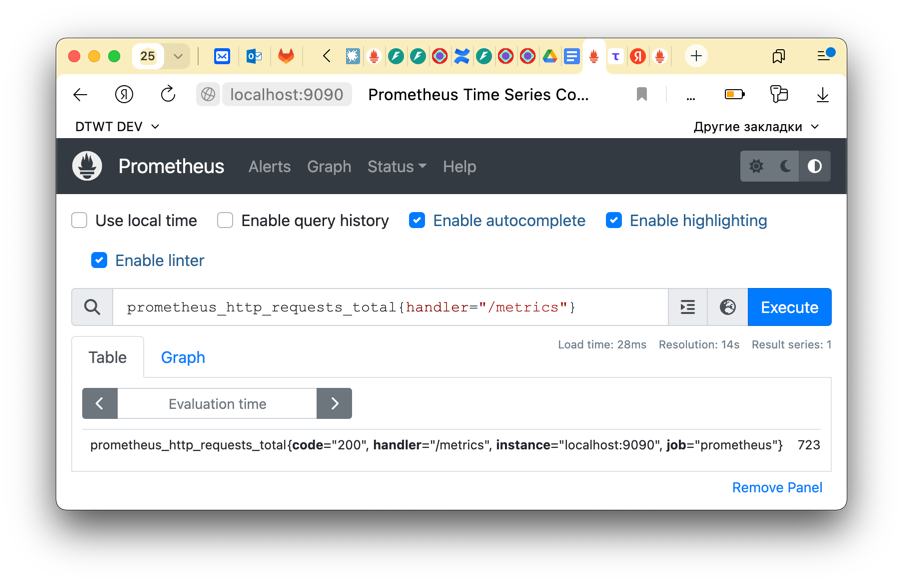
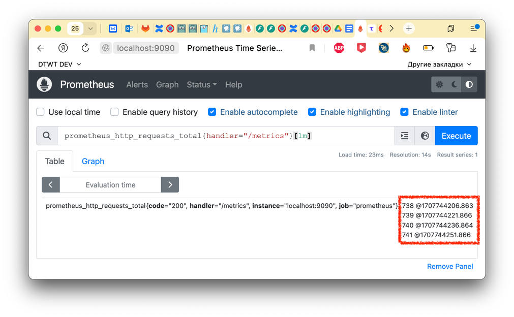
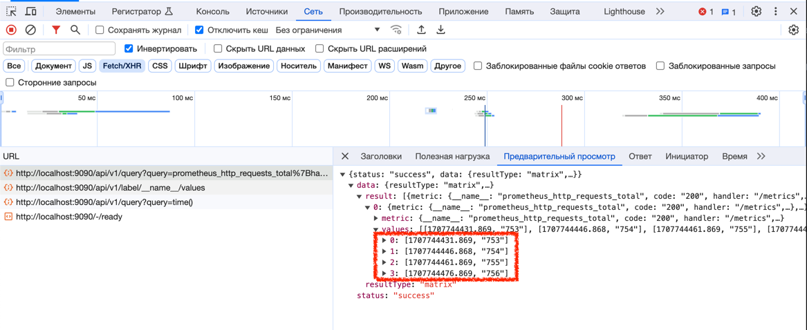

Prometheus предоставляет функциональный язык запросов PromQL (Prometheus Query Language), который позволяет пользователю
выбирать и агрегировать данные временных рядов в режиме реального времени. Результат выражения может быть либо показан в
виде графика, либо просмотрен в виде табличных данных в браузере выражений Prometheus, либо использован внешними
системами через HTTP API.

Мы будем экспериментировать с его родным веб-интерфейсом. Этого достаточно, чтобы наблюдать за запросами и результатами
из БД, и рисовать простые графики.

Самый простой запрос выглядит следующим образом:

```shell
prometheus_http_request_total
```



Если необходимо получить данные по конкретным лейблам, например, `handler="/metrics"`, то необходимо выполнить запрос:

```shell
prometheus_http_request_total{handler="/metrics"}
```



Обратите внимание, что метрика имеет скалярное значение (723).

Для получения значений за определенный промежуток времени назад от текущего времени к запросу в квадратных скобках
указывается временной интервал:

```shell
prometheus_http_request_total{handler="/metrics"}[1m]
```



Обратите внимание, что в интерфейсе отображаются несколько сразу значений. В консоли разработчика можно видеть, что
Prometheus вернул список значений:



## Смещение

Если хотим запросить данные относительно текущего времени назад, например, чтобы сравнить с прошлым днем.

```shell
http_requests_total offset 1d
```

## Логические операции

Логическое «ИЛИ» с помощью регулярных выражений:

```shell
http_requests_total{app=~"apache|nginx|iis.*"}
```

Логическое «И» над одним тегом костылится, если в запросе написать тег несколько раз с разными условиями.

```shell
metric{tag=~"aaa.*", tag=~".*bbb"}
```

## Группировка

Есть функции, которые делают что-то вроде GROUP BY. Предположим, есть такие метрики:

```shell
http_requests_total{app="nginx"}
http_requests_total{app="apache"}
```

Это разные временны́е ряды, и если рисовать их на графике «в лоб» запросом http_requests_total, получим две разные
линии. Если мы хотим объединить их в один график, нужна агрегация. Например, сумма:

```shell
sum(http_requests_total)
```

Результат — один вектор, значит и график будет один. Значения, очевидно, сумма значений всех временных рядов, попавших
под запрос.

Если у нас метрика с кучей тегов, но отобразить нужно только определенные, то можно сгруппировать по тегам:

```shell
sum (http_requests_total) by (app, instance)
```

Можно группировать по «всему кроме тега»:

```shell
sum (http_requests_total) without (instance)
```

## Функции

```shell
rate(range vector)
```

Применяется к возрастающим счетчикам, чтобы показать прирост за какое-то время. Например, количество обработанных
запросов, переданных байт и т.д.

```shell
rate(http_requests_total{app="nginx"}[5m])
```

- считает скорость прироста в секунду (запросов/сек);

- подходит только для counter т.к. полагается на возрастание;

- учитывает сбросы метрики на 0, например при рестартах приложений;

- экстраполируется.

```shell
delta(range vector)
```

Считает разницу между первым и последним значением в интервале. То есть промежуточные значения отбрасываются. Поэтому
можно пропустить резкое изменение, которое быстро откатилось. Вроде бы похож на более грубую версию increase(), но
используется для метрик, которые могут убывать или скакать туда-сюда.

```shell
delta(ram_free{host="postgresql"}[5m])
```

- считает разницу за интервал (сколько запросов пришло);

- подходит только для gauge;

- экстраполируется (поэтому бывают дроби даже когда изменение целое).

[другие функции](https://prometheus.io/docs/prometheus/latest/querying/functions/)

